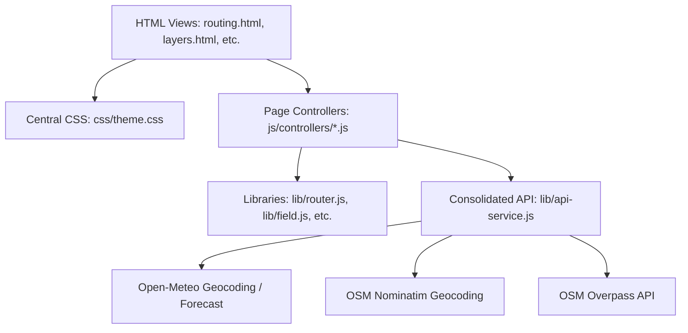
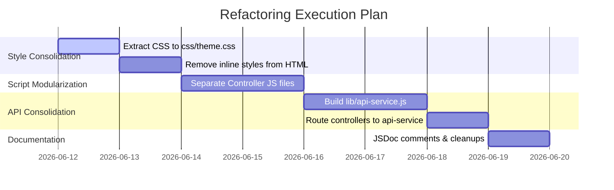

# spec-refactor-guidance.md

**Component:** Codebase Quality & Modular Architecture
**Spec-ID:** refactor-guidance
**Version:** v1
**Status:** draft
**Revised:** 2026-06-11 (UTC)
**Depends-on:** none
**Referenced-by:** —
**Supersedes:** —
**License-posture:** MIT / Proprietary

---

## 1. Objective

The Meridian client application currently operates with a set of heavily overloaded HTML views (`index.html`, `layers.html`, `radio.html`, `routing.html`, `setup.html`) that contain extensive inline `<style>` and `<script>` blocks. While functional, this structure introduces stylesheet redundancy, duplicates core API logic, and degrades code readability. This specification establishes a refactoring plan to modularize styling, extract page controllers, consolidate external API integrations, and document complex math/physics algorithms, making the codebase easier for a human developer to navigate and maintain.

## 2. Scope

**In-Scope:**
- **CSS Extraction:** Consolidating common variables (`:root`), font declarations, and visual component styles into a centralized theme stylesheet (`css/theme.css`).
- **JS Controller Extraction:** Migrating inline `<script>` blocks from HTML views to dedicated page controller files (`js/controllers/`).
- **API Service Consolidation:** Extracting redundant `fetch` calls, geocoding logic, and weather/current data retrieval into a unified library (`lib/api-service.js`).
- **Layout Simplification:** Standardizing header and navigation markup to reduce repetition.
- **Documentation:** Adding JSDoc annotations and explanatory comments to the spherical geometry, polar interpolation, and audio-processing math.

**Out-of-Scope:**
- Altering the core business logic, such as the isochrone routing algorithms in `lib/router.js` or the particle-flow physics in `lib/flow-field.js`.
- Modifying Electron main/preload processes (`electron/main.js` and `electron/preload.js`), unless required to expose unified API utilities.
- Adding new user-facing features or changing the visual layout.

## 3. Architecture

The target architecture shifts the codebase from a "monolithic HTML" model to a clean Separation of Concerns (SoC):



### Proposed Directory Layout

```
/workspace/meridian/
├── css/
│   ├── theme.css             # Unified variables, resets, and layout system
│   └── components.css        # Reusable component-specific styles (e.g. .rbox, .rdist)
├── js/
│   └── controllers/
│       ├── index-controller.js
│       ├── layers-controller.js
│       ├── radio-controller.js
│       ├── routing-controller.js
│       └── setup-controller.js
├── lib/
│   ├── api-service.js        # CONSOLIDATED: fetch calls, geo fallback, wx/currents
│   ├── field.js
│   ├── fieldlayer.js
│   ├── flow-field.js
│   ├── landmask.js
│   ├── orcdata.js
│   ├── router.js
│   ├── telemetry.js
│   ├── topbar.js
│   └── vessel.js
└── index.html, layers.html, etc. # Modularized entrypoints (markup-only)
```

## 4. Code & API Consolidation Points

### 4.1. Styling Consolidation (`css/theme.css`)

Currently, `:root` color tokens, typography rules, and container resets are repeated identically in `routing.html:9-167`, `layers.html:9-104`, `radio.html:8-162`, and `setup.html:8-115`. 
- **Refactor Point:** Extract these definitions into `css/theme.css` and `css/components.css`.
- **Nav Badge Style:** `lib/topbar.js:17-27` injects inline styles for `.mnav` dynamically at runtime. This should be moved to the shared CSS files, keeping `lib/topbar.js` strictly concerned with navigation logic.

### 4.2. API Service Consolidation (`lib/api-service.js`)

Direct `fetch` network requests are scattered across multiple files. We can consolidate these calls into `lib/api-service.js`:

1. **Geocoding Fallback Hierarchy:**
   - Currently, `routing.html:932-955` implements geocoding using `https://nominatim.openstreetmap.org` with a fallback to `https://geocoding-api.open-meteo.com` when OSM rate-limits or fails.
   - Setup page or other future panels lack this fallback search capability.
   - **Refactor Point:** Consolidate geocoding into a shared service function:
     ```javascript
     window.ApiService = {
       async searchPorts(query) { ... }
     };
     ```

2. **Forecast Data Fetching:**
   - Both `routing.html` and `layers.html` make custom API calls to Open-Meteo for wind/current data.
   - **Refactor Point:** Consolidate weather data requests:
     ```javascript
     window.ApiService = {
       ...
       async fetchWindForecast(lat, lon, isEnsemble) { ... },
       async fetchCurrentsForecast(lat, lon) { ... }
     };
     ```

### 4.3. Script Separations

The controller logic in the views consists of heavy browser-bootstrap and UI event handlers.
- **`routing.html` (Lines 300 - 1076):** Extract into `js/controllers/routing-controller.js`. Expose control hooks (`window.m`) from the controller module for `/eval` compatibility.
- **`layers.html` (Lines 214 - 647):** Extract into `js/controllers/layers-controller.js`.
- **`radio.html` (Lines 164 - 702):** Extract into `js/controllers/radio-controller.js`.
- **`setup.html` (Lines 178 - 290):** Extract into `js/controllers/setup-controller.js`.

### 4.4. HTML Header Template Consolidation

Every view duplicates the top bar header markup:
```html
<header>
  <div class="brand">
    <div class="title">MERIDIAN</div>
    <div class="subtitle">...</div>
  </div>
  <nav data-meridian-nav></nav>
  <div class="stamp">...</div>
</header>
```
- **Refactor Point:** Let `lib/topbar.js` dynamically compile and inject the header innerHTML on loading based on attributes on `<header data-meridian-header></header>`. This maintains consistency and reduces boilerplates.

## 5. Dependencies & License Posture

- **Runtime Dependencies:**
  - Cesium.js (Apache 2.0 / WebGL)
  - MapLibre GL (BSD 3-Clause)
  - Deck.gl (MIT)
- **License Posture:** All extracted styles and consolidated JavaScript modules will fall under the project's license (MIT/Proprietary).

## 6. Implementation Phases



### Phase 1: CSS Extraction
1. Create `css/theme.css` and pull the shared `:root` variables, font tags, resets, and layout grid systems.
2. Create `css/components.css` for reusable elements (`.rbox`, `.rdist`, `.loader`, `.mnav`, `.toggle-btn`).
3. Replace CSS blocks in `index.html`, `layers.html`, `radio.html`, `routing.html`, and `setup.html` with stylesheet links.

### Phase 2: Controller Modularization
1. Create `/workspace/meridian/js/controllers/` and migrate the script contents.
2. Link the script files inside each HTML view using `<script src="js/controllers/..."></script>`.
3. Verify that `/eval` control hooks on `window.m` remain fully accessible to Electron's main process.

### Phase 3: API Service Consolidation
1. Build `lib/api-service.js` with structured geocoding fallbacks and weather forecast requests.
2. Swap raw `fetch` calls in `routing-controller.js` and `layers-controller.js` to call the new `ApiService`.

### Phase 4: Layout Standardization
1. Update `lib/topbar.js` to automatically mount the header's brand text and layout structure, reducing manual boilerplates in HTML files.

### Phase 5: Documentation & Comments
1. Document mathematical helpers (e.g. `gcDistance`, `fastDistNm`, `sphereWalk`, `makePolar` bilinear interpolation in `lib/router.js` / `lib/vessel.js`).
2. Add JSDoc comments to clarify parameters and returns.

## 7. Acceptance Criteria

- **Visual Fidelity:** The layout, styling, and interactivity of all pages (`index.html`, `layers.html`, `radio.html`, `routing.html`, `setup.html`) must remain pixel-perfect and function exactly as before.
- **Code Cleanliness:**
  - Zero duplicate CSS rules across HTML files.
  - Inline Javascript in HTML files is limited to configuration/bootstrap calls (under 20 lines).
  - No duplicated geocoding logic.
- **Code Health:**
  - Standard ESLint config checks pass for the new scripts.
  - The local control server's `screenshot` and `eval` functionalities run without warnings.

## 8. Open Questions

- **ES Modules Integration:** Should the new controller files use standard ES modules (`type="module"`)? This would clean up global namespace pollution but requires careful verification against the Electron `contextBridge` context isolation settings and browser CORS behaviors under local `file://` / `app://` origins.
  - **RESOLVED (frontend agent, 2026-06-11, field experience):** `file://`
    pages cannot import ES modules in Chromium — the opaque origin blocks
    them (hit integrating `flow-field.js`, which shipped as an ES module and
    had to be converted to a classic script). Controllers stay **classic
    scripts, one global each** (the established `window.Router` /
    `FieldLayer` / `WxField` pattern). The real fix is serving pages from an
    `app://` custom-scheme origin (the handler already exists for tiles) —
    that is a separate decision, out of scope here.
- **State Synchronization:** If we extract the navigation header construction to `lib/topbar.js`, how do we cleanly expose variables to it without creating circular global dependencies?
